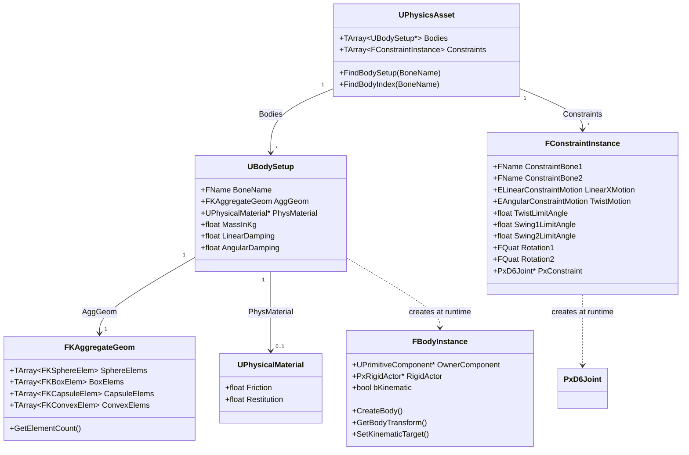

# Physics System Engine Integration Guide

## 개요

이 문서는 PhysX 4.1 SDK를 자체 엔진에 통합하고, 언리얼 엔진 스타일의 Physics Asset 시스템을 구현한 과정을 설명합니다.

---

## 목차

1. [구현 기능 요약](#1-구현-기능-요약)
2. [아키텍처 개요](#2-아키텍처-개요)
3. [핵심 클래스 구조](#3-핵심-클래스-구조)
4. [PhysX SDK 통합](#4-physx-sdk-통합)
5. [Physics Asset Editor 구현](#5-physics-asset-editor-구현)
6. [런타임 시뮬레이션](#6-런타임-시뮬레이션)
7. [디버그 렌더링](#7-디버그-렌더링)
8. [직렬화 및 저장/로드](#8-직렬화-및-저장로드)

---

## 1. 구현 기능 요약

### 1.1 이번 주 구현 목표 및 달성 현황

| 구분 | 기능 | 상태 | 설명 |
|------|------|------|------|
| **에디터** | Physics Asset Editor | 완료 | 본별 Body/Constraint 편집 UI |
| **에디터** | Shape 편집 (Gizmo) | 완료 | 위치/크기/회전 실시간 조정 |
| **에디터** | Generate All Bodies | 완료 | 스켈레톤 기반 자동 생성 |
| **에디터** | Physical Material 시스템 | 완료 | Friction/Restitution 에셋화 |
| **에디터** | Graph View | 완료 | Body/Constraint 관계 시각화 |
| **런타임** | Ragdoll 시뮬레이션 | 완료 | PhysX 기반 물리 시뮬레이션 |
| **런타임** | 디버그 렌더링 | 완료 | Shape/Constraint 시각화 |
| **코어** | PhysX 4.1 통합 | 완료 | SDK 빌드 및 엔진 연동 |

### 1.2 Physics Asset Editor 핵심 기능

#### Body 관리 기능
- **Body 추가**: 선택한 본에 새로운 물리 Body 생성
- **Body 삭제**: 선택한 Body 및 연관 Constraint 자동 제거
- **Shape 타입 선택**: Sphere, Box, Capsule 중 선택하여 추가
- **다중 Shape 지원**: 하나의 Body에 여러 Shape 추가 가능

#### Shape 편집 기능
- **Gizmo 조작**: Translation/Rotation/Scale 모드 지원
- **속성 패널 편집**: Center, Rotation, Size 수치 직접 입력
- **실시간 미리보기**: 편집 중 Shape 변화 즉시 반영

#### Constraint 관리 기능
- **수동 생성**: Start Constraint → Complete Constraint 방식
  - Start Constraint로 선택한 Body가 **Parent**가 됨
  - Complete Constraint로 선택한 Body가 **Child**가 됨
- **자동 생성**: "Add Constraint to Parent" 메뉴로 부모 본과 자동 연결
- **Joint 제한 설정**: Linear/Angular Motion 및 Limit 각도 설정
- **Joint Frame 자동 계산**: 본 방향 기반 Rotation2 자동 설정

#### Generate All Bodies 기능
- **자동 Body 생성**: 스켈레톤의 모든 본에 Capsule Shape 자동 생성
- **본 길이 기반 크기 계산**: 자식 본까지의 거리로 Capsule 크기 결정
- **자동 Constraint 생성**: 부모-자식 관계에 따라 Joint 자동 생성
- **Shape 타입 선택**: Sphere, Box, Capsule 중 선택 가능

#### Physical Material 시스템
- **에셋 기반 관리**: .physmat 파일로 저장/로드
- **Friction (마찰력)**: 0.0 ~ 1.0 범위 설정
- **Restitution (반발력)**: 0.0 ~ 1.0 범위 설정
- **드롭다운 선택**: 기존 Material 선택 또는 새로 생성
- **Edit/Save 토글**: 선택한 Material 직접 편집 기능

#### Graph View 기능
- **노드 기반 시각화**: Body와 Constraint를 노드로 표시
- **계층 구조 표현**: Parent Body → Child Body 연결선
- **줌/패닝**: 마우스 휠 및 드래그로 뷰 조작
- **선택 연동**: 트리뷰/그래프뷰/뷰포트 선택 동기화

#### 시뮬레이션 미리보기
- **Play/Stop 토글**: 에디터 내 Ragdoll 테스트
- **실시간 물리**: PhysX Scene에서 시뮬레이션 실행
- **리셋 기능**: 초기 포즈로 복원

### 1.3 UI 표시 규칙

#### Constraint 표시 형식
| 위치 | 형식 | 예시 |
|------|------|------|
| 트리뷰 라벨 | `[ Parent -> Child ]` | `[ Hips -> Spine ]` |
| 그래프 노드 | `Child : Parent` | `Spine : Hips` |
| Details 패널 | Bone 1 (Child), Bone 2 (Parent) | Bone 1: Spine, Bone 2: Hips |

#### 언리얼 규칙 준수
- `ConstraintBone1` = **Child** (자손 본)
- `ConstraintBone2` = **Parent** (부모 본)

---

## 2. 아키텍처 개요

### 2.1 전체 구조

```
┌─────────────────────────────────────────────────────────────────┐
│                        Editor Layer                              │
│  ┌─────────────────────────────────────────────────────────┐    │
│  │              Physics Asset Editor                        │    │
│  │  - Body/Constraint 편집                                  │    │
│  │  - Shape 추가/삭제/변형                                  │    │
│  │  - Physical Material 관리                                │    │
│  │  - Generate All Bodies                                   │    │
│  └─────────────────────────────────────────────────────────┘    │
└─────────────────────────────────────────────────────────────────┘
                              │
                              ▼
┌─────────────────────────────────────────────────────────────────┐
│                        Asset Layer                               │
│  ┌──────────────┐  ┌──────────────┐  ┌──────────────────────┐   │
│  │ UPhysicsAsset│  │  UBodySetup  │  │  UPhysicalMaterial   │   │
│  │              │  │              │  │                      │   │
│  │ - Bodies[]   │  │ - BoneName   │  │ - Friction           │   │
│  │ - Constraints│  │ - AggGeom    │  │ - Restitution        │   │
│  └──────────────┘  │ - PhysMaterial│  └──────────────────────┘   │
│                    └──────────────┘                              │
└─────────────────────────────────────────────────────────────────┘
                              │
                              ▼
┌─────────────────────────────────────────────────────────────────┐
│                       Runtime Layer                              │
│  ┌──────────────────┐        ┌──────────────────────────────┐   │
│  │   FBodyInstance  │        │     FConstraintInstance      │   │
│  │                  │        │                              │   │
│  │ - PxRigidActor*  │        │ - PxD6Joint*                 │   │
│  │ - OwnerComponent │        │ - ConstraintBone1 (Child)    │   │
│  │ - Shapes[]       │        │ - ConstraintBone2 (Parent)   │   │
│  └──────────────────┘        └──────────────────────────────┘   │
└─────────────────────────────────────────────────────────────────┘
                              │
                              ▼
┌─────────────────────────────────────────────────────────────────┐
│                        PhysX Layer                               │
│  ┌────────────┐  ┌────────────┐  ┌────────────┐  ┌──────────┐   │
│  │ PxScene    │  │PxRigidBody │  │ PxD6Joint  │  │PxMaterial│   │
│  └────────────┘  └────────────┘  └────────────┘  └──────────┘   │
└─────────────────────────────────────────────────────────────────┘
```

### 2.2 데이터 흐름

```
[FBX Import] → [USkeletalMesh] → [Physics Asset Editor] → [UPhysicsAsset (.phys)]
                                                                    │
                                                                    ▼
[Game Runtime] → [USkeletalMeshComponent] → [FBodyInstance/FConstraintInstance]
                                                                    │
                                                                    ▼
                                            [PhysX Scene Simulation]
                                                                    │
                                                                    ▼
                                            [Bone Transform Update (Ragdoll)]
```

### 2.3 주요 파일 구조

```
Mundi/
├── Source/
│   ├── Runtime/
│   │   └── Engine/
│   │       └── Physics/
│   │           ├── PhysicsAsset.h/cpp         # UPhysicsAsset 클래스
│   │           ├── BodySetup.h/cpp            # UBodySetup 클래스
│   │           ├── BodyInstance.h/cpp         # FBodyInstance 런타임
│   │           ├── ConstraintInstance.h/cpp   # FConstraintInstance
│   │           ├── PhysicalMaterial.h/cpp     # UPhysicalMaterial 에셋
│   │           ├── AggregateGeom.h            # FKAggregateGeom (Shape 컨테이너)
│   │           ├── PhysicsSystem.h/cpp        # PhysX 초기화/관리
│   │           └── PhysicsScene.h/cpp         # PxScene 래퍼
│   │
│   └── Slate/
│       └── Windows/
│           └── SPhysicsAssetEditorWindow.h/cpp  # 에디터 UI
│
├── Data/
│   └── Physics/
│       ├── Materials/                         # .physmat 파일들
│       └── *.phys                             # Physics Asset 파일들
│
└── Docs/
    └── PhysicsSystem_Integration.md           # 이 문서
```

---

## 3. 핵심 클래스 구조

### 3.1 UPhysicsAsset

Physics Asset의 최상위 컨테이너 클래스입니다. 하나의 스켈레탈 메시에 대한 모든 물리 정보를 담고 있습니다.

```cpp
// Source/Runtime/Engine/Physics/PhysicsAsset.h

class UPhysicsAsset : public UObject
{
    GENERATED_REFLECTION_BODY()
public:
    // 본별 Body 설정 배열
    // 각 UBodySetup은 특정 본에 연결된 충돌 Shape들을 정의
    UPROPERTY(EditAnywhere, Category = "Physics Asset")
    TArray<UBodySetup*> Bodies;

    // Constraint 배열 (Joint 정의)
    // 두 Body 사이의 물리적 연결 관계 정의
    UPROPERTY(EditAnywhere, Category = "Physics Asset")
    TArray<FConstraintInstance> Constraints;

    // 특정 본에 해당하는 BodySetup 찾기
    UBodySetup* FindBodySetup(const FName& BoneName) const;
    int32 FindBodyIndex(const FName& BoneName) const;
};
```

**역할:**
- 스켈레탈 메시의 물리 설정을 에셋으로 저장
- Bodies 배열: 각 본에 연결된 충돌체 정보
- Constraints 배열: Body 간의 관절(Joint) 정보

### 3.2 UBodySetup

개별 본에 대한 물리 형상(Shape) 정의입니다. 하나의 본에 여러 Shape를 추가할 수 있습니다.

```cpp
// Source/Runtime/Engine/Physics/BodySetup.h

class UBodySetup : public UObject
{
    GENERATED_REFLECTION_BODY()
public:
    // 이 Body가 연결된 본 이름
    UPROPERTY(EditAnywhere, Category = "Body Setup")
    FName BoneName;

    // 충돌 형상 집합 (Sphere, Box, Capsule, Convex)
    UPROPERTY(EditAnywhere, Category = "Body Setup")
    FKAggregateGeom AggGeom;

    // Physical Material 참조 (마찰력, 반발력)
    UPROPERTY(EditAnywhere, Category = "Body Setup")
    UPhysicalMaterial* PhysMaterial = nullptr;

    // 물리 속성
    UPROPERTY(EditAnywhere, Category = "Body Setup")
    float MassInKg = 1.0f;           // 질량 (kg)

    UPROPERTY(EditAnywhere, Category = "Body Setup")
    float LinearDamping = 0.01f;     // 선형 감쇠 (이동 저항)

    UPROPERTY(EditAnywhere, Category = "Body Setup")
    float AngularDamping = 0.05f;    // 각 감쇠 (회전 저항)
};
```

**역할:**
- 특정 본의 충돌체 형상 정의
- 질량, 감쇠 등 물리 속성 설정
- Physical Material 참조로 표면 속성 지정

### 3.3 FKAggregateGeom

여러 종류의 충돌 형상을 담는 컨테이너입니다. 하나의 Body에 다양한 Shape를 조합할 수 있습니다.

```cpp
// Source/Runtime/Engine/Physics/AggregateGeom.h

struct FKAggregateGeom
{
    TArray<FKSphereElem> SphereElems;    // 구 형상
    TArray<FKBoxElem> BoxElems;          // 박스 형상
    TArray<FKCapsuleElem> CapsuleElems;  // 캡슐 형상
    TArray<FKConvexElem> ConvexElems;    // Convex Hull 형상

    int32 GetElementCount() const;
    void EmptyElements();
};

// 개별 Shape Element
struct FKSphereElem
{
    FVector Center;      // 본 기준 로컬 위치
    float Radius;        // 반지름
};

struct FKBoxElem
{
    FVector Center;      // 로컬 위치
    FRotator Rotation;   // 로컬 회전
    FVector Extent;      // 반 크기 (Half Extent)
};

struct FKCapsuleElem
{
    FVector Center;      // 로컬 위치
    FRotator Rotation;   // 로컬 회전
    float Radius;        // 반지름
    float Length;        // 길이 (양쪽 반구 제외한 원기둥 부분)
};
```

**역할:**
- 다양한 충돌 형상을 하나의 구조체에서 관리
- 각 Shape는 본 기준 로컬 좌표로 정의

### 3.4 FConstraintInstance

두 Body 사이의 Joint 정의입니다. 물리적 연결과 움직임 제한을 설정합니다.

```cpp
// Source/Runtime/Engine/Physics/ConstraintInstance.h

struct FConstraintInstance
{
    // ★ 언리얼 규칙: ConstraintBone1 = Child, ConstraintBone2 = Parent
    FName ConstraintBone1;  // Child 본 (움직이는 쪽)
    FName ConstraintBone2;  // Parent 본 (기준이 되는 쪽)

    // Linear Constraint (위치 제한) - 보통 Locked
    ELinearConstraintMotion LinearXMotion = ELinearConstraintMotion::Locked;
    ELinearConstraintMotion LinearYMotion = ELinearConstraintMotion::Locked;
    ELinearConstraintMotion LinearZMotion = ELinearConstraintMotion::Locked;
    float LinearLimit = 0.0f;

    // Angular Constraint (회전 제한)
    EAngularConstraintMotion TwistMotion = EAngularConstraintMotion::Limited;   // X축 회전
    EAngularConstraintMotion Swing1Motion = EAngularConstraintMotion::Limited;  // Y축 회전
    EAngularConstraintMotion Swing2Motion = EAngularConstraintMotion::Limited;  // Z축 회전

    float TwistLimitAngle = 45.0f;   // Twist 제한 각도 (도)
    float Swing1LimitAngle = 45.0f;  // Swing1 제한 각도 (도)
    float Swing2LimitAngle = 45.0f;  // Swing2 제한 각도 (도)

    // Joint Frame (Local Transform)
    FQuat Rotation1 = FQuat::Identity;  // Child 기준 Joint 회전
    FQuat Rotation2 = FQuat::Identity;  // Parent 기준 Joint 회전
    FVector Position2 = FVector::ZeroVector;  // Parent 기준 Joint 위치

    // 인접 본 충돌 비활성화 (보통 true)
    bool bDisableCollision = true;

    // 런타임 PhysX Joint 포인터
    physx::PxD6Joint* PxConstraint = nullptr;
};
```

**역할:**
- 두 Body 사이의 물리적 연결 정의
- 이동(Linear) 및 회전(Angular) 자유도 설정
- Joint의 로컬 좌표계(Frame) 정의

**Motion 타입 설명:**
- `Free`: 제한 없음 (자유롭게 움직임)
- `Limited`: 제한 있음 (설정된 각도/거리 내에서만)
- `Locked`: 완전 잠금 (움직임 불가)

### 3.5 FBodyInstance

런타임에 실제 PhysX Actor를 관리하는 클래스입니다. UBodySetup의 설정을 바탕으로 실제 물리 객체를 생성합니다.

```cpp
// Source/Runtime/Engine/Physics/BodyInstance.h

class FBodyInstance
{
public:
    // 소유 컴포넌트 (충돌 콜백에서 Actor 찾기용)
    UPrimitiveComponent* OwnerComponent = nullptr;

    // PhysX Rigid Actor (Dynamic 또는 Static)
    physx::PxRigidActor* RigidActor = nullptr;

    // Kinematic 모드 여부
    bool bKinematic = false;

    // Body 생성 - UBodySetup 기반으로 PhysX Actor 생성
    void CreateBody(UBodySetup* Setup, const FTransform& Transform, UPrimitiveComponent* Owner);

    // Body 소멸
    void TerminateBody();

    // Transform 동기화
    void SetBodyTransform(const FTransform& NewTransform);
    FTransform GetBodyTransform() const;

    // Kinematic Target 설정 (애니메이션 결과를 물리에 전달)
    void SetKinematicTarget(const FTransform& Target);
};
```

**역할:**
- 에디터 시점의 UBodySetup → 런타임 PhysX Actor 변환
- 물리 시뮬레이션 결과를 게임 오브젝트에 전달
- Kinematic 모드로 애니메이션과 물리 전환 지원

### 3.6 UPhysicalMaterial

마찰력과 반발력을 정의하는 Material Asset입니다. 여러 Body에서 공유 가능합니다.

```cpp
// Source/Runtime/Engine/Physics/PhysicalMaterial.h

class UPhysicalMaterial : public UObject
{
    GENERATED_REFLECTION_BODY()
public:
    // 마찰 계수 (0.0 = 미끄러움, 1.0 = 거침)
    UPROPERTY(EditAnywhere, Category = "Physical Material")
    float Friction = 0.5f;

    // 반발 계수 (0.0 = 에너지 흡수, 1.0 = 완전 탄성)
    UPROPERTY(EditAnywhere, Category = "Physical Material")
    float Restitution = 0.3f;
};
```

**역할:**
- 표면 물리 속성을 에셋으로 관리
- 여러 Body에서 동일한 Material 참조 가능
- .physmat 파일로 저장/로드

---

## 4. PhysX SDK 통합

### 4.1 PhysX 초기화

PhysX를 사용하기 위한 기본 초기화 과정입니다.

```cpp
// Source/Runtime/Engine/Physics/PhysicsSystem.cpp

class FPhysicsSystem
{
private:
    PxFoundation* Foundation = nullptr;      // PhysX 기반
    PxPhysics* Physics = nullptr;            // Physics SDK
    PxDefaultCpuDispatcher* Dispatcher = nullptr;  // 멀티스레드 디스패처
    PxDefaultAllocator Allocator;            // 메모리 할당자
    PxDefaultErrorCallback ErrorCallback;   // 에러 콜백

public:
    void Initialize()
    {
        // 1. Foundation 생성 (PhysX의 기반)
        Foundation = PxCreateFoundation(PX_PHYSICS_VERSION, Allocator, ErrorCallback);

        // 2. Physics 생성 (메인 SDK 객체)
        PxTolerancesScale Scale;
        Physics = PxCreatePhysics(PX_PHYSICS_VERSION, *Foundation, Scale);

        // 3. CPU Dispatcher 생성 (멀티스레드 지원, 4스레드)
        Dispatcher = PxDefaultCpuDispatcherCreate(4);

        // 4. Extensions 초기화 (D6Joint 등 확장 기능 사용을 위해 필수)
        PxInitExtensions(*Physics, nullptr);
    }

    void Shutdown()
    {
        PxCloseExtensions();
        Dispatcher->release();
        Physics->release();
        Foundation->release();
    }
};
```

**초기화 순서:**
1. `PxFoundation`: PhysX의 모든 기능의 기반
2. `PxPhysics`: 실제 물리 연산을 담당하는 메인 객체
3. `PxDefaultCpuDispatcher`: 멀티스레드 시뮬레이션 지원
4. `PxInitExtensions`: D6Joint 등 확장 기능 활성화

### 4.2 Physics Scene 생성

물리 시뮬레이션이 실행되는 Scene을 생성합니다.

```cpp
// Source/Runtime/Engine/Physics/PhysicsScene.cpp

class FPhysicsScene
{
private:
    PxScene* Scene = nullptr;

public:
    void CreateScene(FPhysicsSystem& System)
    {
        PxSceneDesc SceneDesc(System.GetPhysics()->getTolerancesScale());

        // 중력 설정 (cm/s^2 단위, Y-up 기준)
        SceneDesc.gravity = PxVec3(0.0f, -980.0f, 0.0f);

        // CPU 디스패처 연결
        SceneDesc.cpuDispatcher = System.GetDispatcher();

        // 기본 충돌 필터
        SceneDesc.filterShader = PxDefaultSimulationFilterShader;

        // 멀티스레드 및 CCD(연속 충돌 감지) 활성화
        SceneDesc.flags |= PxSceneFlag::eENABLE_ACTIVE_ACTORS;
        SceneDesc.flags |= PxSceneFlag::eENABLE_CCD;

        Scene = System.GetPhysics()->createScene(SceneDesc);
    }

    // 물리 시뮬레이션 스텝
    void Simulate(float DeltaTime)
    {
        Scene->simulate(DeltaTime);
        Scene->fetchResults(true);  // true = 결과 나올 때까지 블로킹
    }
};
```

**Scene 설정:**
- 중력: -980 cm/s² (언리얼 단위 기준)
- CCD: 빠르게 움직이는 물체의 터널링 방지
- Active Actors: 움직인 Actor만 업데이트하여 최적화

### 4.3 PhysX ↔ 엔진 타입 변환

PhysX 타입과 엔진 타입 간의 변환 유틸리티입니다.

```cpp
// Source/Runtime/Engine/Physics/PhysXConversions.h

// 벡터 변환
inline PxVec3 ToPxVec3(const FVector& V)
{
    return PxVec3(V.X, V.Y, V.Z);
}

inline FVector ToFVector(const PxVec3& V)
{
    return FVector(V.x, V.y, V.z);
}

// 쿼터니언 변환
inline PxQuat ToPxQuat(const FQuat& Q)
{
    return PxQuat(Q.X, Q.Y, Q.Z, Q.W);
}

inline FQuat ToFQuat(const PxQuat& Q)
{
    return FQuat(Q.x, Q.y, Q.z, Q.w);
}

// Transform 변환
inline PxTransform ToPxTransform(const FTransform& T)
{
    return PxTransform(ToPxVec3(T.GetLocation()), ToPxQuat(T.GetRotation()));
}

inline FTransform ToFTransform(const PxTransform& T)
{
    return FTransform(ToFQuat(T.q), ToFVector(T.p));
}
```

---

## 5. Physics Asset Editor 구현

### 5.1 에디터 구조

Physics Asset Editor는 ImGui 기반의 에디터 윈도우로, 다음 패널들로 구성됩니다:

```
┌────────────────────────────────────────────────────────────────────┐
│  Physics Asset Editor                                              │
├──────────────┬──────────────────────────────┬─────────────────────┤
│              │                              │                     │
│  ASSET       │      3D Viewport             │    Details Panel    │
│  BROWSER     │                              │                     │
│              │   - Shape 시각화             │  - Body 속성        │
│  - FBX 로드  │   - Gizmo 조작               │  - Shape 속성       │
│              │   - 선택/편집                │  - Constraint 속성  │
├──────────────┤                              │  - Physical Material│
│              │                              │                     │
│  Skeleton    │                              │                     │
│  Tree View   │                              │                     │
│              │                              │                     │
│  - 본 목록   ├──────────────────────────────┤                     │
│  - Body 표시 │      Graph View              │                     │
│  - Constraint│                              │                     │
│    표시      │   - Body 노드               │                     │
│              │   - Constraint 노드         │                     │
│              │   - 연결선                   │                     │
└──────────────┴──────────────────────────────┴─────────────────────┘
```

### 5.2 Body 생성 구현

선택한 본에 새로운 Body를 생성하는 과정입니다.

```cpp
void SPhysicsAssetEditorWindow::AddBodyToBone(int32 BoneIndex)
{
    // 1. 본 이름 가져오기
    const FString& BoneName = Skeleton->Bones[BoneIndex].Name;

    // 2. 이미 Body가 있는지 확인
    if (PhysicsAsset->FindBodySetup(FName(BoneName)) != nullptr)
    {
        UE_LOG("Body already exists for bone: %s", BoneName.c_str());
        return;
    }

    // 3. BodySetup 생성
    UBodySetup* NewBody = NewObject<UBodySetup>();
    NewBody->BoneName = FName(BoneName);

    // 4. 기본 Shape 추가 (본 길이 기반 Capsule)
    float BoneLength = CalculateBoneLength(BoneIndex);
    FKCapsuleElem Capsule;
    Capsule.Center = FVector::ZeroVector;
    Capsule.Rotation = FRotator(0, 0, 90);  // 본 방향에 맞게 회전
    Capsule.Radius = BoneLength * 0.15f;
    Capsule.Length = BoneLength * 0.5f;
    NewBody->AggGeom.CapsuleElems.Add(Capsule);

    // 5. 기본 물리 속성 설정
    NewBody->MassInKg = 1.0f;
    NewBody->LinearDamping = 0.01f;
    NewBody->AngularDamping = 0.05f;

    // 6. Physics Asset에 추가
    PhysicsAsset->Bodies.Add(NewBody);

    // 7. Dirty 플래그 설정 (저장 필요 표시)
    PhysState->bIsDirty = true;
}
```

### 5.3 Constraint 생성 구현

두 Body 사이에 Joint를 생성하는 과정입니다.

```cpp
void SPhysicsAssetEditorWindow::AddConstraintBetweenBodies(int32 ParentBodyIdx, int32 ChildBodyIdx)
{
    UBodySetup* ParentBody = PhysicsAsset->Bodies[ParentBodyIdx];
    UBodySetup* ChildBody = PhysicsAsset->Bodies[ChildBodyIdx];

    // 1. 중복 Constraint 체크
    for (const auto& Existing : PhysicsAsset->Constraints)
    {
        if ((Existing.ConstraintBone1 == ChildBody->BoneName &&
             Existing.ConstraintBone2 == ParentBody->BoneName))
        {
            UE_LOG("Constraint already exists");
            return;
        }
    }

    // 2. Constraint 생성 (언리얼 규칙: Bone1=Child, Bone2=Parent)
    FConstraintInstance Constraint;
    Constraint.ConstraintBone1 = ChildBody->BoneName;   // Child
    Constraint.ConstraintBone2 = ParentBody->BoneName;  // Parent

    // 3. 기본 제한값 설정
    // Linear: 모두 잠금 (본이 빠지지 않도록)
    Constraint.LinearXMotion = ELinearConstraintMotion::Locked;
    Constraint.LinearYMotion = ELinearConstraintMotion::Locked;
    Constraint.LinearZMotion = ELinearConstraintMotion::Locked;

    // Angular: 제한된 범위 내 회전 허용
    Constraint.TwistMotion = EAngularConstraintMotion::Limited;
    Constraint.Swing1Motion = EAngularConstraintMotion::Limited;
    Constraint.Swing2Motion = EAngularConstraintMotion::Limited;
    Constraint.TwistLimitAngle = 45.0f;
    Constraint.Swing1LimitAngle = 45.0f;
    Constraint.Swing2LimitAngle = 45.0f;

    // 4. Joint Frame 계산 (Parent에서 Child로의 상대 위치/회전)
    CalculateJointFrames(Constraint, ParentBody, ChildBody);

    // 5. 인접 본 충돌 비활성화
    Constraint.bDisableCollision = true;

    // 6. Physics Asset에 추가
    PhysicsAsset->Constraints.Add(Constraint);
    PhysState->bIsDirty = true;
}
```

### 5.4 Generate All Bodies 구현

스켈레톤의 모든 본에 자동으로 Body와 Constraint를 생성합니다.

```cpp
void SPhysicsAssetEditorWindow::GenerateAllBodies(EShapeType ShapeType)
{
    // 1. 기존 Body/Constraint 모두 제거
    PhysicsAsset->Bodies.Empty();
    PhysicsAsset->Constraints.Empty();

    // 2. 모든 본에 대해 Body 생성
    for (int32 i = 0; i < Skeleton->Bones.size(); ++i)
    {
        const FBone& Bone = Skeleton->Bones[i];

        // BodySetup 생성
        UBodySetup* Body = NewObject<UBodySetup>();
        Body->BoneName = FName(Bone.Name);

        // 본 길이 계산 (자식 본까지의 평균 거리)
        float BoneLength = CalculateBoneLength(i);

        // Shape 타입에 따라 생성
        switch (ShapeType)
        {
        case EShapeType::Capsule:
            {
                FKCapsuleElem Capsule;
                Capsule.Radius = BoneLength * 0.15f;
                Capsule.Length = BoneLength * 0.5f;
                Capsule.Rotation = FRotator(0, 0, 90);
                Body->AggGeom.CapsuleElems.Add(Capsule);
            }
            break;

        case EShapeType::Sphere:
            {
                FKSphereElem Sphere;
                Sphere.Radius = BoneLength * 0.25f;
                Body->AggGeom.SphereElems.Add(Sphere);
            }
            break;

        case EShapeType::Box:
            {
                FKBoxElem Box;
                Box.Extent = FVector(BoneLength * 0.2f);
                Body->AggGeom.BoxElems.Add(Box);
            }
            break;
        }

        PhysicsAsset->Bodies.Add(Body);
    }

    // 3. 스켈레톤 계층에 따라 Constraint 자동 생성
    for (int32 i = 0; i < Skeleton->Bones.size(); ++i)
    {
        int32 ParentBoneIdx = Skeleton->Bones[i].ParentIndex;
        if (ParentBoneIdx < 0) continue;  // 루트 본은 스킵

        // Child Body와 Parent Body 인덱스 찾기
        int32 ChildBodyIdx = FindBodyIndexByBoneName(Skeleton->Bones[i].Name);
        int32 ParentBodyIdx = FindBodyIndexByBoneName(Skeleton->Bones[ParentBoneIdx].Name);

        if (ChildBodyIdx >= 0 && ParentBodyIdx >= 0)
        {
            // Start=Parent, Complete=Child 순서로 전달
            AddConstraintBetweenBodies(ParentBodyIdx, ChildBodyIdx);
        }
    }

    PhysState->bIsDirty = true;
    UE_LOG("Generated %d bodies and %d constraints",
           PhysicsAsset->Bodies.Num(), PhysicsAsset->Constraints.Num());
}
```

### 5.5 Physical Material 관리

Physical Material의 생성, 편집, 저장 기능입니다.

```cpp
// Material 드롭다운 UI
void SPhysicsAssetEditorWindow::RenderPhysicalMaterialDropdown(UBodySetup* Body)
{
    // 현재 선택된 Material 표시
    FString CurrentName = Body->PhysMaterial ?
        Body->PhysMaterial->GetName() : "None";

    if (ImGui::BeginCombo("Physical Material", CurrentName.c_str()))
    {
        // "None" 옵션
        if (ImGui::Selectable("None", Body->PhysMaterial == nullptr))
        {
            Body->PhysMaterial = nullptr;
            PhysState->bIsDirty = true;
        }

        // 기존 Material 목록
        for (UPhysicalMaterial* Mat : LoadedMaterials)
        {
            bool bSelected = (Body->PhysMaterial == Mat);
            if (ImGui::Selectable(Mat->GetName().c_str(), bSelected))
            {
                Body->PhysMaterial = Mat;
                PhysState->bIsDirty = true;
            }
        }

        // "+ New Material" 옵션
        if (ImGui::Selectable("+ New Material"))
        {
            bShowNewMaterialPopup = true;
        }

        ImGui::EndCombo();
    }

    // Edit/Save 토글 버튼
    if (Body->PhysMaterial)
    {
        if (bEditingMaterial)
        {
            // 편집 모드: Friction/Restitution 슬라이더 표시
            ImGui::DragFloat("Friction", &Body->PhysMaterial->Friction, 0.01f, 0, 1);
            ImGui::DragFloat("Restitution", &Body->PhysMaterial->Restitution, 0.01f, 0, 1);

            if (ImGui::Button("Save"))
            {
                SavePhysicalMaterial(Body->PhysMaterial);
                bEditingMaterial = false;
            }
        }
        else
        {
            if (ImGui::Button("Edit"))
            {
                bEditingMaterial = true;
            }
        }
    }
}

// Material 저장
void SPhysicsAssetEditorWindow::SavePhysicalMaterial(UPhysicalMaterial* Material)
{
    FString FilePath = GDataDir + "/Physics/Materials/" + Material->GetName() + ".physmat";

    nlohmann::json Root;
    Root["Friction"] = Material->Friction;
    Root["Restitution"] = Material->Restitution;

    std::ofstream File(UTF8ToWide(FilePath));
    File << Root.dump(4);
}
```

### 5.6 Graph View 구현

Body와 Constraint의 관계를 시각적으로 표현합니다.

```cpp
void SPhysicsAssetEditorWindow::RenderGraphView()
{
    // 줌/패닝 처리
    if (ImGui::IsWindowHovered())
    {
        // 마우스 휠로 줌
        PhysState->GraphZoom += ImGui::GetIO().MouseWheel * 0.1f;
        PhysState->GraphZoom = FMath::Clamp(PhysState->GraphZoom, 0.5f, 2.0f);

        // 마우스 드래그로 패닝
        if (ImGui::IsMouseDragging(ImGuiMouseButton_Middle))
        {
            PhysState->GraphOffset += ImGui::GetIO().MouseDelta;
        }
    }

    // 각 Constraint에 대해 노드 및 연결선 그리기
    for (int32 i = 0; i < PhysicsAsset->Constraints.Num(); ++i)
    {
        FConstraintInstance& Constraint = PhysicsAsset->Constraints[i];

        // Parent Body 노드 (왼쪽)
        int32 ParentBodyIdx = FindBodyIndex(Constraint.ConstraintBone2);
        ImVec2 ParentPos = CalculateNodePosition(ParentBodyIdx, /*bLeft=*/true);
        DrawBodyNode(ParentPos, Constraint.ConstraintBone2, ParentBodyIdx);

        // Constraint 노드 (가운데)
        ImVec2 ConstraintPos = (ParentPos + ChildPos) * 0.5f;
        DrawConstraintNode(ConstraintPos, Constraint, i);

        // Child Body 노드 (오른쪽)
        int32 ChildBodyIdx = FindBodyIndex(Constraint.ConstraintBone1);
        ImVec2 ChildPos = CalculateNodePosition(ChildBodyIdx, /*bLeft=*/false);
        DrawBodyNode(ChildPos, Constraint.ConstraintBone1, ChildBodyIdx);

        // 연결선 그리기
        DrawList->AddLine(ParentPos, ConstraintPos, LineColor, 2.0f);
        DrawList->AddLine(ConstraintPos, ChildPos, LineColor, 2.0f);
    }
}

// Constraint 노드 그리기
void DrawConstraintNode(ImVec2 pos, FConstraintInstance& Constraint, int32 idx)
{
    // 노드 배경 (주황색)
    DrawList->AddRectFilled(nodeMin, nodeMax, ConstraintColor, 4.0f);

    // "컨스트레인트" 라벨
    DrawList->AddText(pos, TextColor, "컨스트레인트");

    // "Child : Parent" 형식으로 표시
    FString label = StripPrefix(Constraint.ConstraintBone1) + " : " +
                    StripPrefix(Constraint.ConstraintBone2);
    DrawList->AddText(pos, TextColor, label.c_str());
}
```

---

## 6. 런타임 시뮬레이션

### 6.1 Physics Asset 인스턴스화

에디터에서 만든 Physics Asset을 런타임에 실제 PhysX 객체로 변환합니다.

```cpp
void USkeletalMeshComponent::InitializePhysics()
{
    UPhysicsAsset* PhysAsset = SkeletalMesh->PhysicsAsset;
    if (!PhysAsset) return;

    FPhysicsScene* PhysScene = GetWorld()->GetPhysicsScene();

    // 1. 각 BodySetup에 대해 FBodyInstance 생성
    for (UBodySetup* Setup : PhysAsset->Bodies)
    {
        // 해당 본의 현재 Transform 가져오기
        FTransform BoneTransform = GetBoneTransform(Setup->BoneName);

        // FBodyInstance 생성 및 PhysX Actor 생성
        FBodyInstance* Instance = new FBodyInstance();
        Instance->CreateBody(Setup, BoneTransform, this);
        Bodies.Add(Instance);

        // userData에 연결 (충돌 콜백에서 Actor 찾기용)
        Instance->RigidActor->userData = Instance;
    }

    // 2. 각 Constraint에 대해 PhysX Joint 생성
    for (const FConstraintInstance& Setup : PhysAsset->Constraints)
    {
        FConstraintInstance* Instance = new FConstraintInstance(Setup);

        // Child/Parent Body 찾기
        FBodyInstance* ChildBody = FindBodyByBoneName(Setup.ConstraintBone1);
        FBodyInstance* ParentBody = FindBodyByBoneName(Setup.ConstraintBone2);

        // PhysX D6Joint 생성
        CreatePhysXJoint(Instance, ChildBody, ParentBody);
        Constraints.Add(Instance);
    }
}
```

### 6.2 PhysX Body 생성

UBodySetup의 정보로 실제 PhysX RigidDynamic을 생성합니다.

```cpp
void FBodyInstance::CreateBody(UBodySetup* Setup, const FTransform& Transform, UPrimitiveComponent* Owner)
{
    OwnerComponent = Owner;
    FPhysicsSystem& PhysSystem = FPhysicsSystem::Get();
    PxPhysics* Physics = PhysSystem.GetPhysics();

    // 1. RigidDynamic Actor 생성
    PxTransform PxTrans = ToPxTransform(Transform);
    PxRigidDynamic* Dynamic = Physics->createRigidDynamic(PxTrans);

    // 2. Physical Material 기반 PxMaterial 생성
    float Friction = 0.5f;
    float Restitution = 0.3f;
    if (Setup->PhysMaterial)
    {
        Friction = Setup->PhysMaterial->Friction;
        Restitution = Setup->PhysMaterial->Restitution;
    }
    PxMaterial* Material = Physics->createMaterial(Friction, Friction, Restitution);

    // 3. 각 Shape 타입별 PxShape 생성 및 연결
    // Capsule
    for (const FKCapsuleElem& Elem : Setup->AggGeom.CapsuleElems)
    {
        PxCapsuleGeometry Geom(Elem.Radius, Elem.Length * 0.5f);
        PxShape* Shape = Physics->createShape(Geom, *Material);

        // 로컬 Transform 설정
        FTransform LocalTransform(Elem.Rotation.Quaternion(), Elem.Center);
        Shape->setLocalPose(ToPxTransform(LocalTransform));

        Dynamic->attachShape(*Shape);
    }

    // Box
    for (const FKBoxElem& Elem : Setup->AggGeom.BoxElems)
    {
        PxBoxGeometry Geom(ToPxVec3(Elem.Extent));
        PxShape* Shape = Physics->createShape(Geom, *Material);

        FTransform LocalTransform(Elem.Rotation.Quaternion(), Elem.Center);
        Shape->setLocalPose(ToPxTransform(LocalTransform));

        Dynamic->attachShape(*Shape);
    }

    // Sphere
    for (const FKSphereElem& Elem : Setup->AggGeom.SphereElems)
    {
        PxSphereGeometry Geom(Elem.Radius);
        PxShape* Shape = Physics->createShape(Geom, *Material);
        Shape->setLocalPose(PxTransform(ToPxVec3(Elem.Center)));

        Dynamic->attachShape(*Shape);
    }

    // 4. 질량 및 감쇠 설정
    PxRigidBodyExt::setMassAndUpdateInertia(*Dynamic, Setup->MassInKg);
    Dynamic->setLinearDamping(Setup->LinearDamping);
    Dynamic->setAngularDamping(Setup->AngularDamping);

    // 5. Scene에 추가
    PhysSystem.GetScene()->addActor(*Dynamic);

    RigidActor = Dynamic;
}
```

### 6.3 PhysX Joint (D6Joint) 생성

두 Body 사이의 Joint를 생성합니다.

```cpp
void CreatePhysXJoint(FConstraintInstance* Constraint, FBodyInstance* ChildBody, FBodyInstance* ParentBody)
{
    PxPhysics* Physics = FPhysicsSystem::Get().GetPhysics();

    // Child/Parent의 RigidActor 가져오기
    PxRigidActor* PxChild = ChildBody->RigidActor;
    PxRigidActor* PxParent = ParentBody->RigidActor;

    // Local Frame 설정
    // Child 기준: Joint가 자기 원점에 있음
    PxTransform LocalFrame1(ToPxQuat(Constraint->Rotation1));

    // Parent 기준: Child 본 방향으로 오프셋
    PxTransform LocalFrame2(ToPxVec3(Constraint->Position2), ToPxQuat(Constraint->Rotation2));

    // D6Joint 생성
    PxD6Joint* Joint = PxD6JointCreate(*Physics, PxParent, LocalFrame2, PxChild, LocalFrame1);

    // Linear Motion 설정 (보통 모두 Locked)
    Joint->setMotion(PxD6Axis::eX, ToPxMotion(Constraint->LinearXMotion));
    Joint->setMotion(PxD6Axis::eY, ToPxMotion(Constraint->LinearYMotion));
    Joint->setMotion(PxD6Axis::eZ, ToPxMotion(Constraint->LinearZMotion));

    // Angular Motion 설정
    Joint->setMotion(PxD6Axis::eTWIST, ToPxMotion(Constraint->TwistMotion));
    Joint->setMotion(PxD6Axis::eSWING1, ToPxMotion(Constraint->Swing1Motion));
    Joint->setMotion(PxD6Axis::eSWING2, ToPxMotion(Constraint->Swing2Motion));

    // Angular Limit 설정 (도 → 라디안 변환)
    if (Constraint->TwistMotion == EAngularConstraintMotion::Limited)
    {
        float TwistRad = FMath::DegreesToRadians(Constraint->TwistLimitAngle);
        Joint->setTwistLimit(PxJointAngularLimitPair(-TwistRad, TwistRad));
    }

    if (Constraint->Swing1Motion == EAngularConstraintMotion::Limited ||
        Constraint->Swing2Motion == EAngularConstraintMotion::Limited)
    {
        float Swing1Rad = FMath::DegreesToRadians(Constraint->Swing1LimitAngle);
        float Swing2Rad = FMath::DegreesToRadians(Constraint->Swing2LimitAngle);
        Joint->setSwingLimit(PxJointLimitCone(Swing1Rad, Swing2Rad));
    }

    // 충돌 비활성화 설정
    if (Constraint->bDisableCollision)
    {
        Joint->setConstraintFlag(PxConstraintFlag::eCOLLISION_ENABLED, false);
    }

    Constraint->PxConstraint = Joint;
}
```

### 6.4 Ragdoll 시뮬레이션 업데이트

매 프레임 물리 시뮬레이션 결과를 본에 적용합니다.

```cpp
void USkeletalMeshComponent::TickPhysics(float DeltaTime)
{
    if (!bSimulatePhysics) return;

    // PhysX 시뮬레이션은 FPhysicsScene::Simulate()에서 처리됨
    // 여기서는 결과를 본에 적용

    for (int32 i = 0; i < Bodies.Num(); ++i)
    {
        FBodyInstance* Body = Bodies[i];
        if (!Body || !Body->RigidActor) continue;

        // PhysX에서 현재 Transform 가져오기
        PxTransform PxTrans = Body->RigidActor->getGlobalPose();
        FTransform BodyTransform = ToFTransform(PxTrans);

        // 해당 본 인덱스 찾기
        FName BoneName = PhysicsAsset->Bodies[i]->BoneName;
        int32 BoneIndex = GetBoneIndex(BoneName);

        if (BoneIndex >= 0)
        {
            // 본 Transform 업데이트 (Ragdoll 결과 적용)
            BoneSpaceTransforms[BoneIndex] = BodyTransform;
        }
    }

    // 스키닝 행렬 재계산
    RefreshBoneTransforms();
}
```

### 6.5 Kinematic ↔ Dynamic 전환

애니메이션 재생과 물리 시뮬레이션 간 전환을 처리합니다.

```cpp
// 모든 Body를 Kinematic으로 설정 (애니메이션 모드)
void USkeletalMeshComponent::SetAllBodiesKinematic(bool bKinematic)
{
    for (FBodyInstance* Body : Bodies)
    {
        if (PxRigidDynamic* Dynamic = Body->RigidActor->is<PxRigidDynamic>())
        {
            Dynamic->setRigidBodyFlag(PxRigidBodyFlag::eKINEMATIC, bKinematic);
        }
        Body->bKinematic = bKinematic;
    }
}

// Kinematic Body에 애니메이션 결과 적용
void USkeletalMeshComponent::UpdateKinematicBodies()
{
    for (int32 i = 0; i < Bodies.Num(); ++i)
    {
        FBodyInstance* Body = Bodies[i];
        if (!Body->bKinematic) continue;

        // 애니메이션에서 계산된 본 Transform 가져오기
        FName BoneName = PhysicsAsset->Bodies[i]->BoneName;
        FTransform BoneTransform = GetBoneTransformByName(BoneName);

        // Kinematic Target 설정
        if (PxRigidDynamic* Dynamic = Body->RigidActor->is<PxRigidDynamic>())
        {
            Dynamic->setKinematicTarget(ToPxTransform(BoneTransform));
        }
    }
}
```

---

## 7. 디버그 렌더링

### 7.1 Shape 시각화

물리 Shape를 와이어프레임으로 렌더링합니다.

```cpp
void FRagdollDebugRenderer::RenderBodies(const TArray<FBodyInstance*>& Bodies)
{
    for (FBodyInstance* Body : Bodies)
    {
        FTransform BodyTransform = Body->GetBodyTransform();
        UBodySetup* Setup = Body->GetBodySetup();

        // Capsule 렌더링
        for (const FKCapsuleElem& Elem : Setup->AggGeom.CapsuleElems)
        {
            FTransform ShapeTransform = FTransform(Elem.Rotation.Quaternion(), Elem.Center) * BodyTransform;

            // 캡슐 메시 생성 및 와이어프레임 렌더링
            DrawWireCapsule(ShapeTransform.GetLocation(),
                           ShapeTransform.GetRotation(),
                           Elem.Radius,
                           Elem.Length,
                           FColor::Green);
        }

        // Box 렌더링
        for (const FKBoxElem& Elem : Setup->AggGeom.BoxElems)
        {
            FTransform ShapeTransform = FTransform(Elem.Rotation.Quaternion(), Elem.Center) * BodyTransform;

            DrawWireBox(ShapeTransform.GetLocation(),
                       ShapeTransform.GetRotation(),
                       Elem.Extent,
                       FColor::Blue);
        }

        // Sphere 렌더링
        for (const FKSphereElem& Elem : Setup->AggGeom.SphereElems)
        {
            FVector WorldPos = BodyTransform.TransformPosition(Elem.Center);

            DrawWireSphere(WorldPos, Elem.Radius, FColor::Red);
        }
    }
}
```

### 7.2 Constraint 시각화

Joint의 제한 범위를 시각화합니다.

```cpp
void FRagdollDebugRenderer::RenderConstraints(const TArray<FConstraintInstance*>& Constraints)
{
    for (FConstraintInstance* Constraint : Constraints)
    {
        // Joint 위치 및 방향 계산
        FTransform JointTransform = GetConstraintWorldTransform(Constraint);
        FVector JointPos = JointTransform.GetLocation();
        FQuat JointRot = JointTransform.GetRotation();

        // Twist Limit 시각화 (X축 회전 범위)
        if (Constraint->TwistMotion == EAngularConstraintMotion::Limited)
        {
            DrawTwistLimit(JointPos, JointRot,
                          Constraint->TwistLimitAngle,
                          FColor::Yellow);
        }

        // Swing Limit 시각화 (Y/Z축 회전 범위 - 콘 형태)
        if (Constraint->Swing1Motion == EAngularConstraintMotion::Limited ||
            Constraint->Swing2Motion == EAngularConstraintMotion::Limited)
        {
            DrawSwingCone(JointPos, JointRot,
                         Constraint->Swing1LimitAngle,
                         Constraint->Swing2LimitAngle,
                         FColor::Cyan);
        }

        // 축 표시 (X=Red, Y=Green, Z=Blue)
        DrawCoordinateAxes(JointPos, JointRot, 10.0f);
    }
}
```

---

## 8. 직렬화 및 저장/로드

### 8.1 Physics Asset 파일 형식 (.phys)

```json
{
    "Version": 1,
    "Bodies": [
        {
            "BoneName": "mixamorig6:Hips",
            "MassInKg": 10.0,
            "LinearDamping": 0.01,
            "AngularDamping": 0.05,
            "Friction": 0.5,
            "Restitution": 0.3,
            "Capsules": [
                {
                    "Center": [0, 0, 0],
                    "Rotation": [0, 0, 90],
                    "Radius": 8.5,
                    "Length": 15.0
                }
            ],
            "Boxes": [],
            "Spheres": []
        }
    ],
    "Constraints": [
        {
            "ConstraintBone1": "mixamorig6:Spine",
            "ConstraintBone2": "mixamorig6:Hips",
            "LinearXMotion": "Locked",
            "LinearYMotion": "Locked",
            "LinearZMotion": "Locked",
            "TwistMotion": "Limited",
            "Swing1Motion": "Limited",
            "Swing2Motion": "Limited",
            "TwistLimitAngle": 30.0,
            "Swing1LimitAngle": 20.0,
            "Swing2LimitAngle": 20.0,
            "Rotation1": [0, 0, 0, 1],
            "Rotation2": [0, 0, 0, 1],
            "Position2": [0, 15, 0],
            "bDisableCollision": true
        }
    ]
}
```

### 8.2 Physical Material 파일 형식 (.physmat)

```json
{
    "Friction": 0.7,
    "Restitution": 0.2
}
```

### 8.3 저장 구현

```cpp
bool PhysicsAssetEditorBootstrap::SavePhysicsAsset(UPhysicsAsset* Asset, const FString& FilePath)
{
    nlohmann::json Root;
    Root["Version"] = 1;

    // Bodies 직렬화
    nlohmann::json BodiesArray = nlohmann::json::array();
    for (UBodySetup* Body : Asset->Bodies)
    {
        nlohmann::json BodyObj;
        BodyObj["BoneName"] = Body->BoneName.ToString();
        BodyObj["MassInKg"] = Body->MassInKg;
        BodyObj["LinearDamping"] = Body->LinearDamping;
        BodyObj["AngularDamping"] = Body->AngularDamping;

        // Physical Material
        if (Body->PhysMaterial)
        {
            BodyObj["Friction"] = Body->PhysMaterial->Friction;
            BodyObj["Restitution"] = Body->PhysMaterial->Restitution;
        }

        // Capsules
        nlohmann::json CapsulesArray = nlohmann::json::array();
        for (const FKCapsuleElem& Elem : Body->AggGeom.CapsuleElems)
        {
            nlohmann::json CapsuleObj;
            CapsuleObj["Center"] = {Elem.Center.X, Elem.Center.Y, Elem.Center.Z};
            CapsuleObj["Rotation"] = {Elem.Rotation.Pitch, Elem.Rotation.Yaw, Elem.Rotation.Roll};
            CapsuleObj["Radius"] = Elem.Radius;
            CapsuleObj["Length"] = Elem.Length;
            CapsulesArray.push_back(CapsuleObj);
        }
        BodyObj["Capsules"] = CapsulesArray;

        // Boxes, Spheres도 유사하게...

        BodiesArray.push_back(BodyObj);
    }
    Root["Bodies"] = BodiesArray;

    // Constraints 직렬화
    nlohmann::json ConstraintsArray = nlohmann::json::array();
    for (const FConstraintInstance& Constraint : Asset->Constraints)
    {
        nlohmann::json ConstraintObj;
        ConstraintObj["ConstraintBone1"] = Constraint.ConstraintBone1.ToString();
        ConstraintObj["ConstraintBone2"] = Constraint.ConstraintBone2.ToString();
        ConstraintObj["TwistLimitAngle"] = Constraint.TwistLimitAngle;
        ConstraintObj["Swing1LimitAngle"] = Constraint.Swing1LimitAngle;
        ConstraintObj["Swing2LimitAngle"] = Constraint.Swing2LimitAngle;
        // ... 나머지 필드들
        ConstraintsArray.push_back(ConstraintObj);
    }
    Root["Constraints"] = ConstraintsArray;

    // 파일 쓰기
    std::ofstream File(UTF8ToWide(FilePath));
    File << Root.dump(4);  // 4칸 들여쓰기
    return File.good();
}
```

---

## 부록 A: 클래스 다이어그램



---

## 부록 B: 용어 정리

| 용어 | 설명 |
|------|------|
| **Body** | 하나의 본에 연결된 물리 충돌체 |
| **Shape** | 실제 충돌 형상 (Sphere, Box, Capsule 등) |
| **Constraint** | 두 Body 사이의 관절(Joint) 연결 |
| **DOF (Degrees of Freedom)** | 자유도 - 움직일 수 있는 방향의 수 |
| **Twist** | X축 기준 회전 (비틀기) |
| **Swing** | Y/Z축 기준 회전 (흔들기) |
| **Kinematic** | 물리 시뮬레이션 대신 직접 위치를 제어하는 모드 |
| **Dynamic** | 물리 시뮬레이션에 의해 움직이는 모드 |
| **Ragdoll** | 캐릭터가 힘없이 쓰러지는 물리 시뮬레이션 |

---

## 참고 자료

- [PhysX 4.1 Documentation](https://nvidiagameworks.github.io/PhysX/4.1/documentation/physxguide/Index.html)
- [Unreal Engine Physics Asset Documentation](https://docs.unrealengine.com/5.0/en-US/physics-asset-editor-in-unreal-engine/)
- [PhysX Visual Debugger](https://developer.nvidia.com/physx-visual-debugger)
